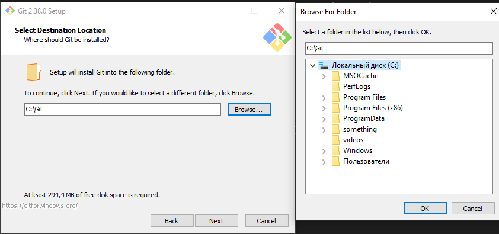
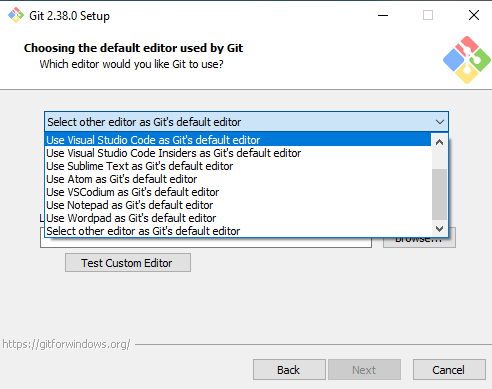
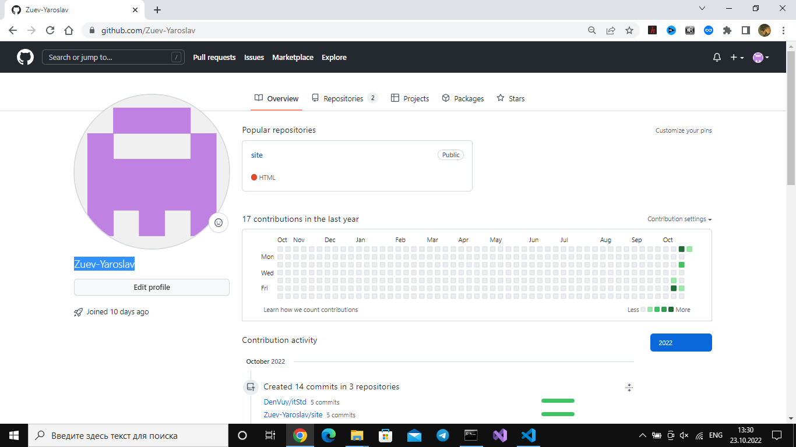
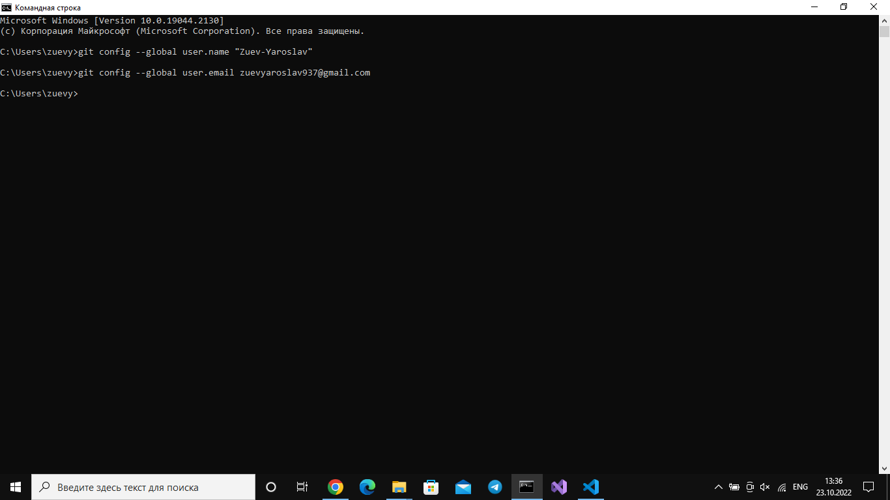

# Установка Git на Windows 

1. [Ссылка на скачивание](https://www.google.com/url?sa=t&rct=j&q=&esrc=s&source=web&cd=&cad=rja&uact=8&ved=2ahUKEwjpq_uN1vP6AhWNHuwKHXw3C7sQFnoECA4QAQ&url=https%3A%2F%2Fgit-scm.com%2Fdownload%2Fwin&usg=AOvVaw2-COXREi99EWhNd760ZDz_)

2. Установка
-   Нажать на установщик и следовать пунктам:

Next
Если просят выбрать путь для установки, то устанавливайте в C:, чтобы в будущем для написания .bat файлов(Если мы будем это делать) не было проблем.

Next 
В этом пункте выбираем Use Visual Studio Code as Git's default editor

Next
... 
...

И так до конца Next

В конце Install 
```
3. Открыть коммандную строку  
-   Win + R   
-   Внутри пишем cmd 
   -    Нажать ОК

<br></br>
Или в стркое поиска (Win + S) написать **cmd** 

Для проверки написать: 
```
cd ..
git --help 

Если отображается много текста --> Значит все ОК

Далее: 

git config --global user.name "__тут_пиши_свой_ник_в_GitHub__"
git config --global user.email <_пиши_свою_почту_которую_ты_регистрировал_в_Git_>



```


