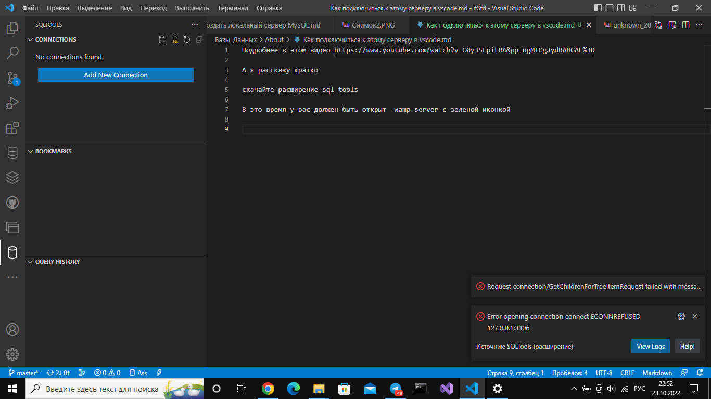
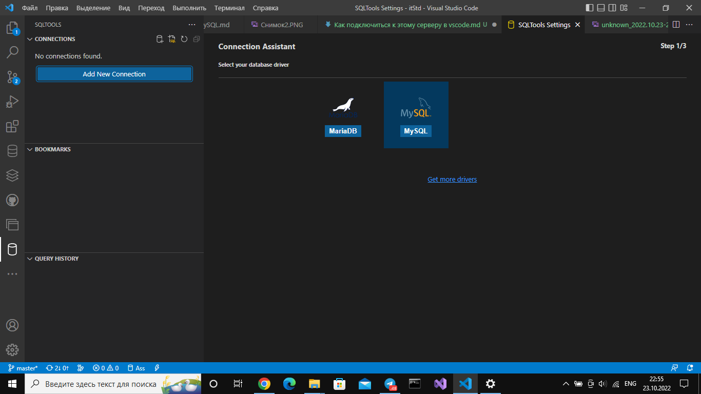
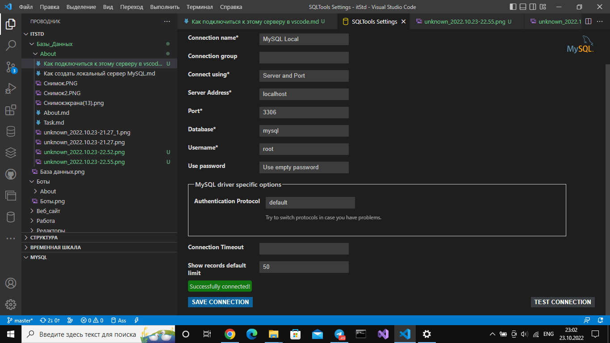

Подробнее в этом видео https://www.youtube.com/watch?v=C0y35FpiLRA&pp=ugMICgJydRABGAE%3D

А я расскажу кратко

В это время у вас должен быть открыт  wamp server с зеленой иконкой и авторизован под ником root

Для начала у вас должен быть создана своя БД ниже будет ролик

https://disk.yandex.ru/i/zaMJyQDMYMvH0A

# 1 способ

скачайте расширение sql tools

Передите на sqltools ==> Add new connection

Далее сюда

вводите данные как у меня

Проверяйте, нажав на test connection >> SAVE CONNECTION >> CONNECT NOW

Можете что-нибудь пописать в MySQL, то что делаете обычно на БД у Сафиуллины

# 2 способ

До меня дошло, ToolsSQL не особо нужен

Поэтому можно через database 

ссылка на видео

https://disk.yandex.ru/i/Zb2ChCW7ZjND5A