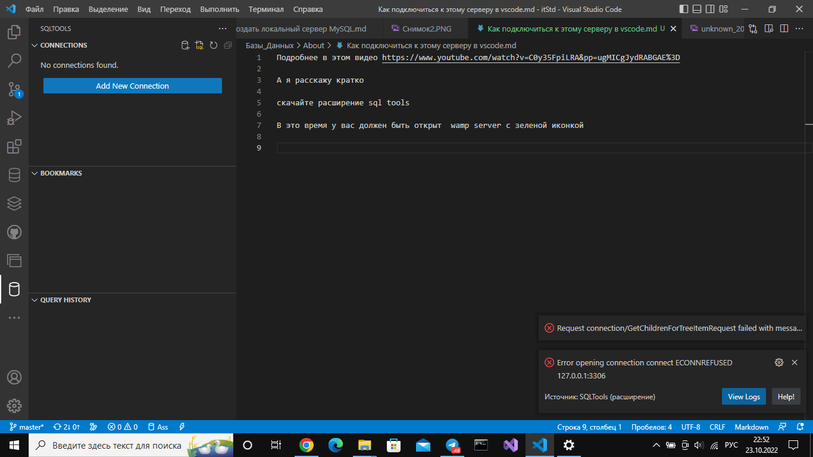
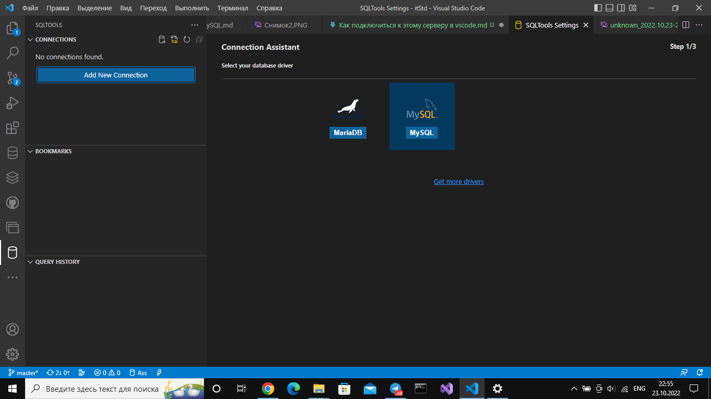

Подробнее в этом видео https://www.youtube.com/watch?v=C0y35FpiLRA&pp=ugMICgJydRABGAE%3D

А я расскажу кратко

скачайте расширение sql tools

В это время у вас должен быть открыт  wamp server с зеленой иконкой и авторизован под ником root

Передите на sqltools ==> Add new connection

Далее сюда

вводите данные как у меня

Проверяйте, нажав на test connection >> SAVE CONNECTION >> CONNECT NOW

Можете что-нибудь пописать в MySQL, то что делаете обычно на БД у Сафиуллины