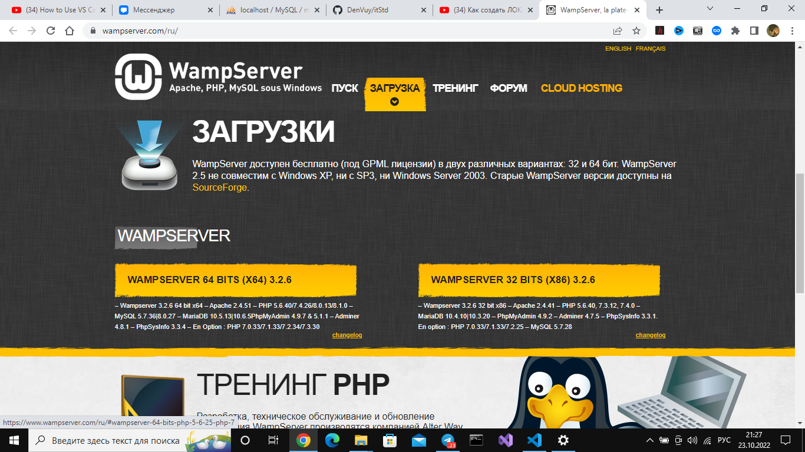
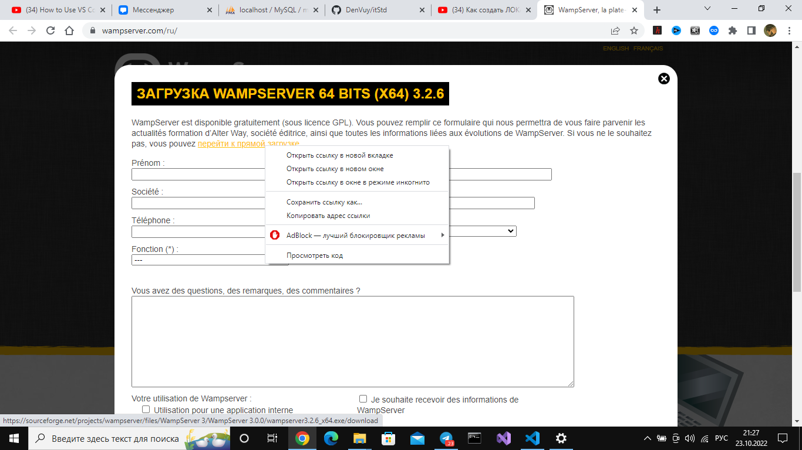
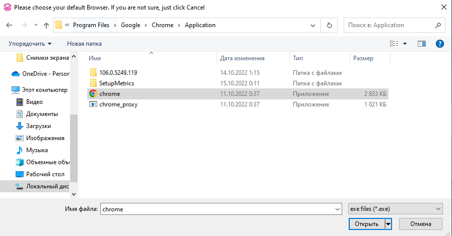
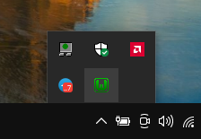

Скачиваем Wamp Server по ссылке: http://www.wampserver.com/ru/

Запускайте установщик и устанавливайте

После установки выведит сообщение о смене браузера с Internet explorer на другой

Надеюсь у всех есть chrome и указывайте путь к этому файлу

Выведет ещё одно сообщение, нажимайте НЕТ

Запустите эту программу. Будут запускаться несколько консолей, но не бойтесь

Дождитесь такого значка до зелёного цвета и кликайте на него один раз

==> phpmyadmin (По-моему без разницы какая версия)

.png)

ВПЕРЁД