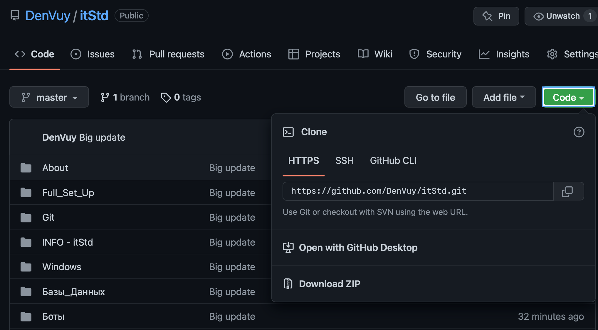

# Первый шаг

### Тут все достаточно просто

1. Быть в телеграмм чате 
2. Куда нибудь сохранить ссылку на данный репозиторий 

    > [Вот ссылка (нажми)](https://github.com/DenVuy/itStd)

<br></br>
    
<br></br>

```
 Например: 
   * Записки в телефоне (нежелательно)
   * "Избранное" в телеграмме 
   * Закладки в браузере  
```


1. Работать на компе (или ноут)
2. Открыть папки  
   * INFO - itStd
   * Git
   * Редакторы -> VS code  

Внутри есть файлы в которых все написано: 
- Как установить 
- Как зарегистрироваться 
- Как писать 
- и т.п.

<br></br>

> ### По всем вопросам писать в чат 

<br></br>
<br></br>


